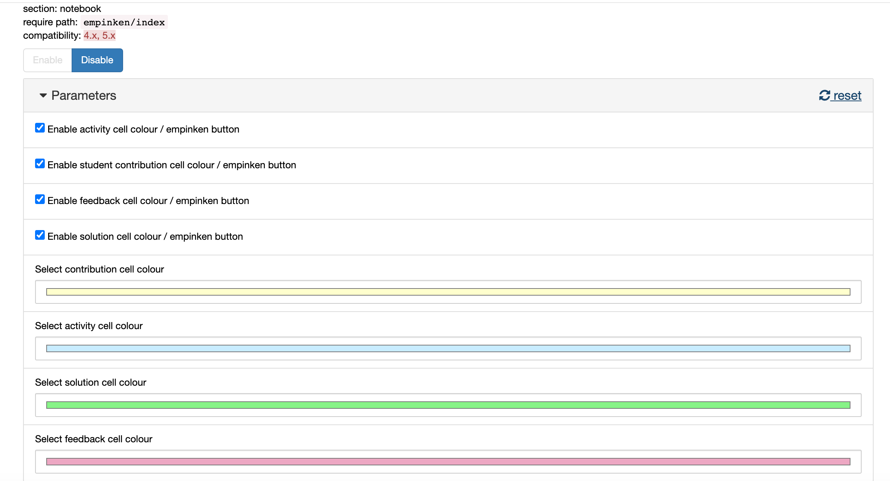
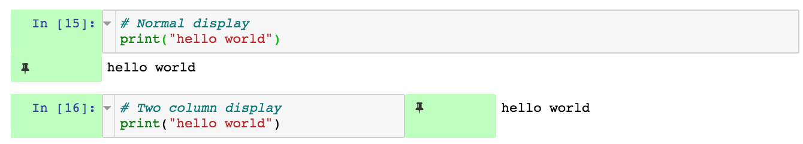
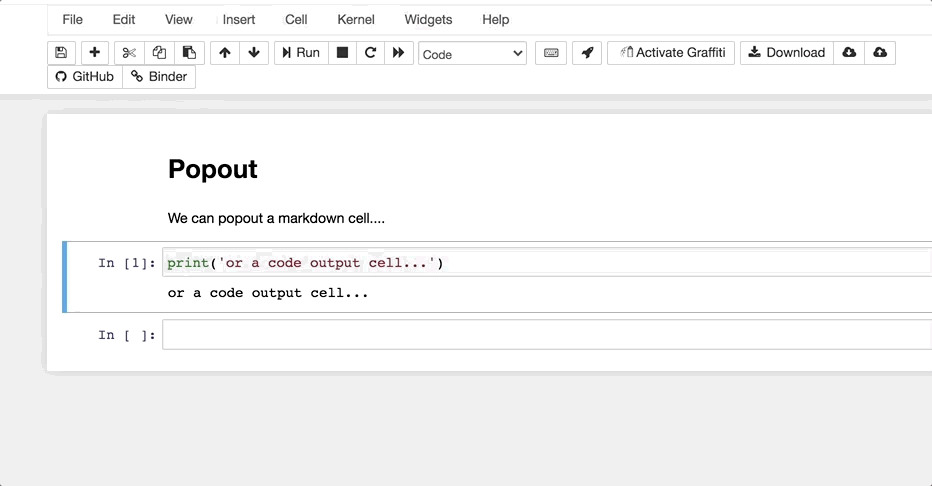

# Introduction

*OpenJALE*, the *Open Jupyter Authoring and Learning Environment*, is an opinionated Jupyter notebook based environment for authoring and working with notebook based learning materials.

This document describes a range of currently available extensions that support customisation of a Jupyter environment to enrich both the authoring and end user experience.

For example, extensions are available to support productivity and quality processes, rendering of content, and activity design and presentation.

*Many of the extensions described have been and are being used in modules in presentation, as well as being used to support their production.

# Customising the Jupyter Environment

An unextended Jupyter notebook or JupyterLab environment provides a minimal interactive environment for creating and working with Jupyter notebooks.

However, by pre-configuring a Jupyter notebook environment with a range of pre-installed and pre-enabled notebook extensions, we can create a much richer environment for authoring and working with notebooks.

By authoring learning materials in a way that exploits the use or application of particular extensions, we can create a much more powerful teaching and learning environment.

This document will review a range of extensions that may be used to support:

- authoring materials;
- editing materials;
- using materials.

Where Jupyter notebooks accessed via a Jupyter notebook environment are the intended delivery medium, and the OU has control or influence over how that environment is configured, preinstalled and pre-enabled extensions potentially provide a richer canvas for authoring in at least three respects:

- how materials are rendered;
- what they can do, and
- the actions learners can take within them.

Note that the Jupyter environment may also be used as pure authoring environment to author structure materials. Such materials can then be published and rendered in formats *other* than the Jupyter notebook, such as HTML book formats or "print" (PDF,  docx) materials.

*An OU Teach and Learn project is currently under submission (May, 2021) to explore pathways for converting between OU-XML and Jupyter `.ipynb` document formats which would allow the Jupyter notebook environment to become a generally availably authoring environment for authoring and editing OU-XML mediated content, such as VLE content.*

# TO DO magics
not across kernels, cf extensions which are

## Customising the Authoring Environment

Customising the authoring environment may be viewed in various ways. For example, installing extensions that support writing and productivity (for example, side by side markdown preview, spellchecker) versus installing extensions that modify or enable features in the end-user presentation environment, and that may influence how materials are authored.

If notebooks are used to author structured content materials, for example targeted at OU-XML, extensions may be required to enable the simplified tagging of particular elements.

## Customising the Teaching and Learning Environment

*TLDR: Jupyter notebooks can be customised  we can provide students with a to test/review materials as designed, you need to test them in the environment they were designed for.*

An ongoing point of contention both within and across module teams using or exploring Jupyter notebooks relates to the extent to which we should or should not author notebooks for use in a particular environment.

A key point to bear in mind here is the idea of the "notebook environment". The default, classic Jupyter notebook UI is a minimal affair. (The same could be argued for JupyterLab framework environments.)

A wide variety of extensions can be installed that enrich the Jupyter notebook experience. Typically, these *notebook extensions* customise notebook user interface. Installing an extension typically requires downloading and installing a Python package, which typically installs the extension into the notebook server automatically. Extensions may also need to be enabled, which can be done automatically in a provided environment or manually via the notebook nbextensions configurator. Installed notebook extensions may be enabled or disabled by the user at any time via the nbextensions configurator.

In TM351, notebooks are written that exploit the preconfigured environment we provide students with. For example, notebooks are tagged to show various coloured sections for activities or highlight calls to action, answers or sample solutions are hidden, coloured "info-boxes" highlight particular items and so on.

In an off-the-shelf environment, none of these enhancements will be visible. We could argue the display degrades gracefully for each extension that is not available and not enabled. This degradation may be made more graceful by reinforcing certain distinctions. For instance, tagged "info-box" content ordinarily coloured by an extension might be presented using italicised text to reinforce the distinction from main flow text. Even without the the colour, the distinction remains.

In a certain sense, we might argue that there is an *implicit dependence* on certain extensions in some materials. To the student, there may be nothing in the notebook that makes them think there is anything missing in the notebook. For example, if an activity cell is not coloured, so what? There may be ambiguity about when the activity ends, but that is often clear from the structure of the text. The colour *enriches* the message that something is activity related, but is not required for that message.

In some cases, there may be clues that something is missing. For example, the call out to "click the triangle at the side to reveal the answer" in a collapsed answer doesn't make sense if there is no triangle and the answer is displayed. We could tweak the text to fix that: "if the answer is hidden, click the triangle to the side to reveal it". Or we could update the extension so that it's a bit cleverer and inserts the text on how to reveal the answer if the extension is enabled and responsible for hiding the answer.

Other notebooks may make *explicit* calls on the availability of a particular extension or some functionality that it provides. The extension developed for TM351 to render an image showing the current structure of a connected database is explicitly referenced and used in the text, as well as being available as a tool students can use on their own initiative to visually check the state of their database.

Explicit references may also be made in the text that refer to operations the student needs to perform using notebook toolbar buttons that are installed by particular extensions: no extension = no button = no access to functionality referenced in the material.

These explicit references *do not* necessarily degrade gracefully unless they are used in an optional or nice to have way that is not on the critical path of an activity or notebook narrative. More likely, if the extension is not available, the materials will be "broken" in the sense that something referred to is not available.

*There are implications here for user-testing or review of materials: the notebooks should be tested in the assumed provided environment. Further testing in an off-the-shelf / unextended environment may be advisable to see just how broken the experience might be in such an environment with a view to making materials work at some acceptable level in such environments.*

*There are also implications for recommending emerging best practice or conventions used successfully in one module to other modules. One way of disseminating practice across module teams is for particular individuals associated with module to work on another; another route is for editors to share practice. IET(?) attempt to get module teams to engage in learning design at the start of a module production process but do not make technology related recommendations or suggestions and have not engaged with TM351 or Tm129 module practices in terms of capturing, evaluating or critiquing emerging notebook practice.*

The following table captures some of the arguments for and against providing a customised environment. It is not intended to be exhaustive.

|FOR customised environments| AGAINST customised environments|
|---|---|
|Value add feature| Reduced potential audience|
|Materials can be enhanced by exploiting extension behaviours| Materials are broken without extensions|
|Provided environment comes with preinstalled and pre-configured extensions so no student overhead | Students must use the provided environment or try to upgrade a third party or off-the-shelf environment themselves to work with our materials |

## A Question of Defaults

When providing an environment to authors, or distributing an environment to students, it is possible to pre-install certain components but not necessarily pre-enable them,

This means that users may selectively choose to enable notebook extensions and customise their environment without having to install any additional packages.

When students use a supplied environment, extensions enabled *by default* provide students with preconfigured environment that may reflect:

- the *opinion* of the module team regarding extensions that students may find useful;
- extensions that the module team have designed the notebooks to work with in the expectation that they will be provided as part of a *provided* notebook environment.

In abstract terms, we might think of a layered model when it comes to defining the user environment

|Layer|Role|
|---|---|
|Base environment| common base environment; eg in Dockerised virtual environment, the base operating system or base container|
|Base Jupyter environment |A core Jupyter environment to build on, common to the sort of environment that might be expected of-the-shelf|
|Extended Jupyter environment| Includes: branding; preinstalled extensions; pre-enabled extensions |
|Base computing environment| For example, the basic kernel(s) accessed from the base Jupyter environment|
|Module specific computing environment|Module specific packages, as for example installed as requirements of a single, otherwise empty, module package |
|Generic content| For example, general purpose Jupyter notebook tutorials that may be used across modules |
|Module specific content| For example, module specific Jupyter notebooks|

Note that a significant point of difference arises between:

- environments that are installed by students using off-the-shelf installers or services which we might term *__pure self-service__ environments*;
- environments that are provided by the OU but installed by students themselves, which we might term *__provided self-service__ environments*;
- environments that are provided in a preconfigured form by the OU with no installation requirement placed on students, which we might term *__provided__ environments*

In terms of providing environments to students across modules, a question arises regarding the extent to which module teams might customise the environment or use a configuration that is, insofar as is possible, common to and consistent across all modules.

Where students are required to install an environment in a pure self-service model, a question arises as to how they should install any additional packages or extensions required by the module, or whether the module should *prima facie* be designed to work the the off-the shelf environment the student is expected to install or sign up to in the case of an "off-the-shelf" hosted service environment.

# Classic Notebook Extensions Configurator

In the classic Jupyter notebook environment, the `nbextensions` configurator provides a handy interfacing for managing installed extensions.

Installed extensions are automatically listed and may be enabled / disabled from the configurator.

If an extension has its own configuration settings, this are displayed and can be controlled when the extension is selected in the `nbconfigurator` installed extensions list.

Configuration settings are saved to a config file and may be distributed as part of an environment.

*What is currently lacking is a tool that can detect and install publicly listed extensions. At the moment, there is no reliable extensions registry / list that I am aware of.*

# Authoring Arbitrary Text Documents in the Notebook Editor

TO DO - jupytext

# Authoring Extensions

## Editing Environment Extensions

### Live markdown Preview

The  `jupyter-contrib-nbextensions` packaged *live markdown preview* extension will provide a live preview of text currently being edited in a markdown cell. A notebook extensions configurator panel allows the user to select whether the preview appears directly below the cell being edited (the default behaviour) or to the side.

*Note that the highlighted spellchecking as text is entered comes from the `spellchecker` extension.*

## Quality Process Extensions

TO DO  - code prettify (also R)
 
TO DO - auopep8

TO DO pycodestyle_magic / flake8_magic

### Spellchecking

The `jupyter-contrib-nbextensions` packaged *spellchecker* extension will highlight unrecognised words in markdown cells that are in edit mode.

The configurator can be used to display a toolbar button to toggle the operation of the spellchecker; the dictionary used for spellcheck lookups can also be specified.

The extension will also offer a live preview as you type:
 
 
 
*Note that the live rendered markdown preview is provided by the live markdown preview extension.*

The configurator allows to the live markdown preview to be automatically applied enabled in each opened notebook.

# Styling Extensions

Various extensions are available that can influence the way materials are presented. For example, different coloured background cells.

## `empinken`

The [`nb_extension_empinken`](https://github.com/innovationOUtside/nb_extension_empinken) extension provides several buttons for applying colour style to a single cell:

The buttons actually add tags to the cell to invoke the styling:

A configuration panel allows the user to control which (if any) buttons are displayed, as well as the colour applied in each case.

## `tagstyler`

The [`nb_extension_tagstyler`](https://github.com/innovationOUtside/nb_extension_tagstyler) provides a simple way to apply Bootstrap `alert` style styling to cells based on a cell tag:

# Visual and Audio Layout and Feedback Extensions

Several extensions exist that can be used to add various forms of visual or audio feedback to the notebook user interface.

These extensions might be used in part to help maintain a sense of situational awareness about the state of the various cells.

See also: *Accessibility Extensions*

## Cell Execution Status

The [`nb_cell_execution_status`](https://github.com/innovationOUtside/nb_cell_execution_status) extension uses colour in code cell gutters to indicate the run status of each code cell:

- white: not executed
- light cyan: awaiting execution
- green: successfully executed
- pink: failed

This provides useful feedback on which part of the notebook has been run during a notebook session.

Audible feedback for successful and unsuccessful cell completion can also be enabled from the notebook extension configurator menu:

## Two Column Display

The [`twoCol`](https://github.com/innovationOUtside/nb_extension_twoCol) extension provides a toolbar button that will toggle the display of a selected code cell from a one column to a two column display, allowing the code cell output to be displayed alongside, rather than below, a code cell.

*For feature requests relating to further development of this extension, please [file an issue](https://github.com/innovationOUtside/nb_extension_twoCol/issues) on the repository.*

# Accessibility Extensions

See also: *Visual and Audio Feedback Extensions*

## `accessibility_toolbar`

A no longer supported extension developed as part of a Masters project, the [`accessibility_toolbar`](https://github.com/uclixnjupyternbaccessibility/accessibility_toolbar) extension adds a toolbar to your notebook with five separate accessibility tools:

- apply style changes to the notebook (eg font selection, font size, line height, letter spacing);
- spell checker;
- accessible themes;
- voice control (voice control for several notebook commands);
- planner/notepad (pop-up markdown notepad for taking notes alongside the notebook; content saved inside the `.ipynb` notebook document).

*The stability of this extension is moot; if you would like to use this extension, or see it developed further, please raise issues on this [fork of the original repository](https://github.com/ouseful-PR/accessibility_toolbar/issues).*

## `jupyter-a11y`

The [`jupyter-a11y`](https://github.com/ouseful-backup/jupyter-a11y/) extension is a proof-of-concept exensions that provides a range of audible reporting tools to support notebook use.

- background hum when kernel busy;
- identify command / edit mode (Ctrl-Shift-M / Ctrl-Shift-M);
- the mode is announced when you click in a cell;
- identify cell location (Shift-G / Ctrl-Shift-G); eg "cell number 4 of 45"; [could maybe identify code or markdown cell?];
- read cell contents (Shift-R / Ctrl-Shift-R) [identifies cell type and number of lines; lines don't seem to be read correctly? Seems like one line at a time is read and things queue up somewhere?]

The extension is unsupported and not very stable; if you are interested in using this extension, please [raise an issue](https://github.com/ouseful-backup/jupyter-a11y/issues) on the repository to expedite work on maintenance and feature request development.

## `jupyterthemes`

The [`jupyterthemes`](https://github.com/dunovank/jupyter-themes) extension supports a range of themes and theme customisations.

Themes are set form the command line. The command line commands allow a particular theme to be selected and applied to all opened notebooks, and additional customisations to be applied to layout if required, including:

- markdown cell font size and style;
- code cell font size and style;
- output area and Mathjax font size;
- line height;
- margin width;
- cell width;
- cursor width / color;
- pandas dataframe output styling.

Note that using a custom theme may break other other extensions. Use the issues on a [fork of the `jupyterthemes`](https://github.com/ouseful-PR/jupyter-themes/issues) repo to discuss local/OU issues relating to this extension.

# Custom Activity Extensions and Magics

In certain cases, extensions or magics might be created to support or enable particular activities within the notebook environment.

See also: *Appendix — exploiting rich `__repr__` outputs*.

For example, an extension created to support live diagramming of the table structure of a connected relational database.

## Blockdiag Magic

The [`ipython_magic_blockdiag`](https://github.com/innovationOUtside/ipython_magic_blockdiag) extension installs various magics for creating diagrams using the [`blockdiag`(](http://blockdiag.com/en/index.html)family of diagram scripting Python packages.

## Cell Diff

The [`cell_diff`](https://github.com/innovationOUtside/nb_cell_diff) extension is based on the Google `diff-match-patch` package and provides a range of simple tools for ad hoc, in notebook, code cell differencing.

## Cell Popout

The [`nb_cell_dialog`](https://github.com/innovationOUtside/nb_cell_dialog) extension allows cells and code cell outputs to be popped out into a separate floating widget. Closing the widget sends the cell back to its original location in the notebook:

## Cell Shell

The [`cell_shell`](https://github.com/innovationOUtside/nb_cell_shell) magic allows a user to force the notebook to run each code cell in a notebook in a separate Python shell. This means that there are no hidden state effects, but requires that each code cell contains a complete program in order to run.

## Database Schema Display

The [`ipython_magic_sqlalchemy_schemadisplay`](https://github.com/innovationOUtside/ipython_magic_sqlalchemy_schemadisplay) magic will create and display a simple visual entity relation diagram depicting the structure of a connected database.

This extension is being used in a module on database management and analysis to visualise the structure of provided databases as part of worked activities, as well as allowing students to visualise the structure of databases they have constructed for themselves.

TO DO - flowchart magic

TO DO - sql magic

TO DO - cypher magic

TO DO - datasette magic

## `nbtutor` Code Stepper

The [`nbtutor`](https://github.com/lgpage/nbtutor) extension provides a simple code stepper and variable inspector at the code cell level.

The `nbtutor` extension supports activities framed around stepping through code a line at a time within a single code cell.

## `skip-traceback`

The `skip-traceback` extension, which forms part of the official unoffical `jupyter-contrib-nbextensions` distribution, will collapse a full Python error message beneath a collapsed header:

*Note that the pink error highlight in the cell gutter is provided by the `cell_status` extension.*

THe configurator panel for the extension allows the `skip-traceback` function to be automatically be enabled or disabled for each notebook that is opened, as well as an optional toolbar button for enabling / disabling the behaviour:

# Recipes

This section includes various recipes for how to mix-and-match the behaviout of several extensions in order to achieve a particular effect.

## Python Code Error Reporting

Use the `cells_status` and `skip_traceback` extensions to help identify and improve the display of Python errors.

## Notebook Activity Sections

Activities can be identified and style using the `empinken` extension to style cells and the `collapisble headings` extension to hide activity answers.

## Spellchecked and Previewed Editing

Using the spellcheck and live markdown preview extensions, you can preview the styled output of markdown text currently being edited as well as live spellchecking in the edited cell.

# JupyterLab Extensions

JupyterLab is the next generation Jupyter user interface, employing user interface framework components different from the classic notebook. This means that classic notebook extensions will not work in the JupyterLab context.

To migrate "extension enhanced" notebooks into the JupyterLab context, classic notebook extensions will have to be ported to JupyterLab, or equivalents found amongst the currently available JupyterLab extensions.

The following JupyterLab extensions offer similar functionality to classic notebook extensions although they may not use the same metadata or tag components to enable or declare features, so conversion of notebook `.ipynb` may be required to update metadata from classic notebook extension metadata to metadata formats expected by JupyterLab extensions.

## Collapsible Headings

The [JupyterLab `Collapsible_Headings` extension](https://github.com/aquirdTurtle/Collapsible_Headings) ostensibly works in the same way as the classic notebook extension, using a `heading_collapsed` metadata attribute in a notebook cell to identify the header from which a collapse begins.

However, the value assigned to `heading_collapsed` is *not* the same in the JupyterLab and classic extensions. In the classic extension, the assignment is to the boolean `true`; in the JupyterLab extension, the assignment is to the string `"true"`.

See this [related issue](https://github.com/aquirdTurtle/Collapsible_Headings/issues/38) requesting metadata parity across extensions.

TO DO 

[jupyter-scribe](https://github.com/jupytercalpoly/jupyterlab-richtext-mode) JupyterLab extension _"transforms Markdown cells into rich-text-editing cells, powered by ProseMirror"_.

# Appendix — exploiting rich `__repr__` Outputs {-}

# Appendix — Jupyter server proxy applications {-}

RStudio
OpenRefine
TM129 proxies

# Authoring Notebooks in VS Code {-}
