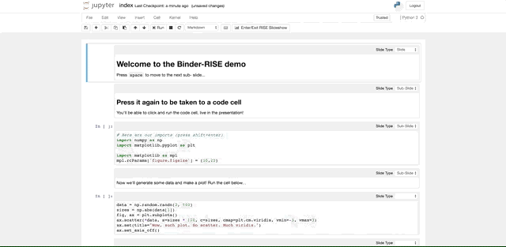
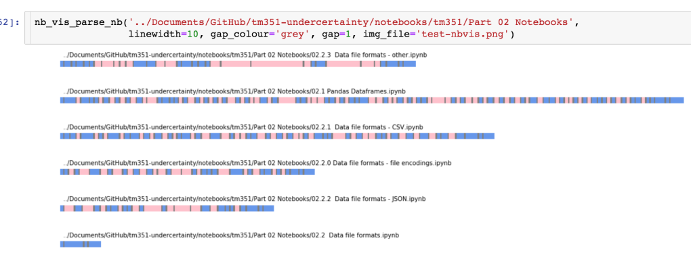
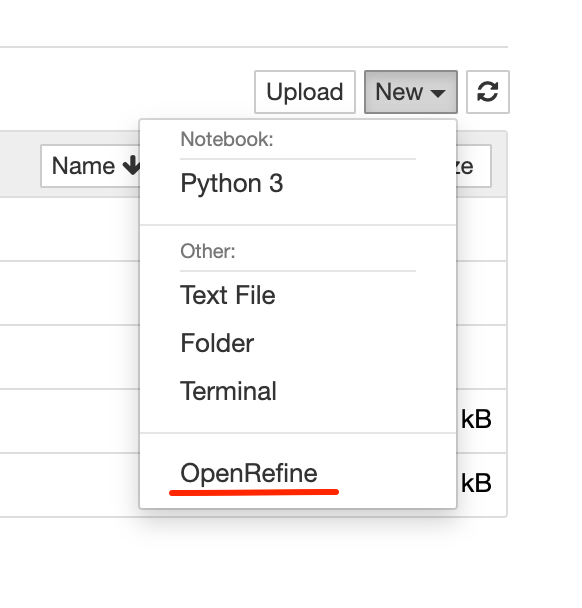

# Introduction

*OpenJALE*, the *Open Jupyter Authoring and Learning Environment*, is an open, opinionated Jupyter notebook based environment for authoring and working with notebook based learning materials.

It's open not least in the sense that you are free to set up the environment as you want by installing and enabling particular extensions to customise the environment. It's opinionated to the extent that I have opinions about which extensions I like, and how they can be used to together to create particular effects in a teaching and learning environment. Not all the available Jupyter extensions are listed here, perhaps because I don't like them, perhaps because I don't think they are relevant, perhaps because or forgot or haven't got round to them yet. (This document is a living document and is subject to change...)

The document describes a range of currently available extensions that support customisation of a Jupyter environment to enrich both the authoring and end user experience.

For example, extensions are available to support productivity and quality processes, rendering of content, and activity design and presentation.

*Many of the extensions described have been and are being used in modules in presentation, as well as being used to support their production. As such, many of the opinions are based on experience of, and practice in, using various set-ups to support the production and presentation of teaching and learning over the last five years or so.*


# Customising the Jupyter Environment

An unextended Jupyter notebook or JupyterLab environment provides a minimal interactive environment for creating and working with Jupyter notebooks.

However, by pre-configuring a Jupyter notebook environment with a range of pre-installed and pre-enabled notebook extensions, we can create a much richer environment for authoring and working with notebooks.

By authoring learning materials in a way that exploits the use or application of particular extensions, we can create a much more powerful teaching and learning environment.

This document will review a range of extensions that may be used to support:

- authoring materials;
- editing materials;
- using materials.

Where Jupyter notebooks accessed via a Jupyter notebook environment are the intended delivery medium, and the OU has control or influence over how that environment is configured, preinstalled and pre-enabled extensions potentially provide a richer canvas for authoring in at least three respects:

- how materials are rendered;
- what they can do, and
- the actions learners can take within them.

Note that the Jupyter environment may also be used as pure authoring environment to author structure materials. Such materials can then be published and rendered in formats *other* than the Jupyter notebook, such as HTML book formats or "print" (PDF,  docx) materials.

*An OU Teach and Learn project is currently under submission (May, 2021) to explore pathways for converting between OU-XML and Jupyter `.ipynb` document formats which would allow the Jupyter notebook environment to become a generally availably authoring environment for authoring and editing OU-XML mediated content, such as VLE content.*


## Extension Flavours

There are three main ways in which a Jupyter notebook environment may be extended:

- notebook extensions: these extensions add functionality to the Jupyter notebook user interface, and typically install additional Javascript into the user interface that can modify the behaviour of the interface; a particulat
- server extensions: these extensions modify the behaviour of the server; for example, server extensions might allow novel document formats to be opened into the notebook environment or exported from it;
- IPython magics: IPython magics can be defined that either act as "macro" style commands, or that modify the behaviour of a code cell (block cell magics); for example, block cell magics can be used to transform a code cell connected to a Python kernel to one that accepts SQL code that the Python kernel can then use as part of a query onto a connected database.

A further class of "extension" comes in the form of packages installed in the Python (or R) kernel that are capable of generating "rich" output. For example, a wide variety of packages exist that make it easy to output an interactive map into a code cell output, or musical notation according to a provided score.

*For a wide range of examples of packages that can produce static and interactive (rich) media outputs as part of a Jupyter Authoring system, see [`SubjectMatterNotebooks`](https://opencomputinglab.github.io/SubjectMatterNotebooks/).*

For an excellent guide to notebook extensions, see the [*Unofficial Jupyter Notebook Extensions*](https://jupyter-contrib-nbextensions.readthedocs.io/en/latest/index.html).

For creating Jupyter which transform code cell text using calls to the active kernel, see [*KernelExecOnCells library *](https://jupyter-contrib-nbextensions.readthedocs.io/en/latest/nbextensions/code_prettify/README.html#kernelexeconcells-library-and-nbextensions).

See also: [Jupyter notebook docs: *Extending the Notebook*](https://jupyter-notebook.readthedocs.io/en/stable/extending/index.html)

## Customising the Authoring Environment

Customising the authoring environment may be viewed in various ways. For example, installing extensions that support writing and productivity (for example, side by side markdown preview, spellchecker) versus installing extensions that modify or enable features in the end-user presentation environment, and that may influence how materials are authored.

If notebooks are used to author structured content materials, for example targeted at OU-XML, extensions may be required to enable the simplified tagging of particular elements.


## Customising the Teaching and Learning Environment

*TLDR: Jupyter notebooks can be customised  we can provide students with a to test/review materials as designed, you need to test them in the environment they were designed for.*

An ongoing point of contention both within and across module teams using or exploring Jupyter notebooks relates to the extent to which we should or should not author notebooks for use in a particular environment.

A key point to bear in mind here is the idea of the "notebook environment". The default, classic Jupyter notebook UI is a minimal affair. (The same could be argued for JupyterLab framework environments.)

A wide variety of extensions can be installed that enrich the Jupyter notebook experience. Typically, these *notebook extensions* customise notebook user interface. Installing an extension typically requires downloading and installing a Python package, which typically installs the extension into the notebook server automatically. Extensions may also need to be enabled, which can be done automatically in a provided environment or manually via the notebook nbextensions configurator. Installed notebook extensions may be enabled or disabled by the user at any time via the nbextensions configurator.

In TM351, notebooks are written that exploit the preconfigured environment we provide students with. For example, notebooks are tagged to show various coloured sections for activities or highlight calls to action, answers or sample solutions are hidden, coloured "info-boxes" highlight particular items and so on.

In an off-the-shelf environment, none of these enhancements will be visible. We could argue the display degrades gracefully for each extension that is not available and not enabled. This degradation may be made more graceful by reinforcing certain distinctions. For instance, tagged "info-box" content ordinarily coloured by an extension might be presented using italicised text to reinforce the distinction from main flow text. Even without the the colour, the distinction remains.

In a certain sense, we might argue that there is an *implicit dependence* on certain extensions in some materials. To the student, there may be nothing in the notebook that makes them think there is anything missing in the notebook. For example, if an activity cell is not coloured, so what? There may be ambiguity about when the activity ends, but that is often clear from the structure of the text. The colour *enriches* the message that something is activity related, but is not required for that message.

In some cases, there may be clues that something is missing. For example, the call out to "click the triangle at the side to reveal the answer" in a collapsed answer doesn't make sense if there is no triangle and the answer is displayed. We could tweak the text to fix that: "if the answer is hidden, click the triangle to the side to reveal it". Or we could update the extension so that it's a bit cleverer and inserts the text on how to reveal the answer if the extension is enabled and responsible for hiding the answer.

Other notebooks may make *explicit* calls on the availability of a particular extension or some functionality that it provides. The extension developed for TM351 to render an image showing the current structure of a connected database is explicitly referenced and used in the text, as well as being available as a tool students can use on their own initiative to visually check the state of their database.

Explicit references may also be made in the text that refer to operations the student needs to perform using notebook toolbar buttons that are installed by particular extensions: no extension = no button = no access to functionality referenced in the material.

These explicit references *do not* necessarily degrade gracefully unless they are used in an optional or nice to have way that is not on the critical path of an activity or notebook narrative. More likely, if the extension is not available, the materials will be "broken" in the sense that something referred to is not available.

*There are implications here for user-testing or review of materials: the notebooks should be tested in the assumed provided environment. Further testing in an off-the-shelf / unextended environment may be advisable to see just how broken the experience might be in such an environment with a view to making materials work at some acceptable level in such environments.*

*There are also implications for recommending emerging best practice or conventions used successfully in one module to other modules. One way of disseminating practice across module teams is for particular individuals associated with module to work on another; another route is for editors to share practice. IET(?) attempt to get module teams to engage in learning design at the start of a module production process but do not make technology related recommendations or suggestions and have not engaged with TM351 or Tm129 module practices in terms of capturing, evaluating or critiquing emerging notebook practice.*

The following table captures some of the arguments for and against providing a customised environment. It is not intended to be exhaustive.

|FOR customised environments| AGAINST customised environments|
|---|---|
|Value add feature| Reduced potential audience|
|Materials can be enhanced by exploiting extension behaviours| Materials are broken without extensions|
|Provided environment comes with preinstalled and pre-configured extensions so no student overhead | Students must use the provided environment or try to upgrade a third party or off-the-shelf environment themselves to work with our materials |


## A Question of Defaults

When providing an environment to authors, or distributing an environment to students, it is possible to pre-install certain components but not necessarily pre-enable them,

This means that users may selectively choose to enable notebook extensions and customise their environment without having to install any additional packages.

When students use a supplied environment, extensions enabled *by default* provide students with preconfigured environment that may reflect:

- the *opinion* of the module team regarding extensions that students may find useful;
- extensions that the module team have designed the notebooks to work with in the expectation that they will be provided as part of a *provided* notebook environment.

In abstract terms, we might think of a layered model when it comes to defining the user environment

|Layer|Role|
|---|---|
|Base environment| common base environment; eg in Dockerised virtual environment, the base operating system or base container|
|Base Jupyter environment |A core Jupyter environment to build on, common to the sort of environment that might be expected of-the-shelf|
|Extended Jupyter environment| Includes: branding; preinstalled extensions; pre-enabled extensions |
|Base computing environment| For example, the basic kernel(s) accessed from the base Jupyter environment|
|Module specific computing environment|Module specific packages, as for example installed as requirements of a single, otherwise empty, module package |
|Generic content| For example, general purpose Jupyter notebook tutorials that may be used across modules |
|Module specific content| For example, module specific Jupyter notebooks|

Note that a significant point of difference arises between:

- environments that are installed by students using off-the-shelf installers or services which we might term *__pure self-service__ environments*;
- environments that are provided by the OU but installed by students themselves, which we might term *__provided self-service__ environments*;
- environments that are provided in a preconfigured form by the OU with no installation requirement placed on students, which we might term *__provided__ environments*

In terms of providing environments to students across modules, a question arises regarding the extent to which module teams might customise the environment or use a configuration that is, insofar as is possible, common to and consistent across all modules.

Where students are required to install an environment in a pure self-service model, a question arises as to how they should install any additional packages or extensions required by the module, or whether the module should *prima facie* be designed to work the the off-the shelf environment the student is expected to install or sign up to in the case of an "off-the-shelf" hosted service environment.


# Recipes

This section includes various recipes for how to mix-and-match the behaviour of several extensions in order to achieve a particular effect.

Later sections will review individual extensions in more detail.

## Python Code Error Reporting

Use the `cells_status` and `skip_traceback` extensions to help identify and improve the display of Python errors.


## Notebook Activity Sections

Activities can be identified and style using the `empinken` extension to style cells and the `collapisble headings` extension to hide activity answers.


## Spellchecked and Previewed Editing

Using the spellcheck and live markdown preview extensions, you can preview the styled output of markdown text currently being edited as well as live spellchecking in the edited cell.


# Classic Notebook Extensions & Configurator

A large number of very useful "official unoffocial" community contributed extensions are distributed as part of the [`jupyter_contrib_nbextensions`](https://jupyter-contrib-nbextensions.readthedocs.io/en/latest/index.html) package

In the classic Jupyter notebook environment, the [`nbextensions` configurator](https://github.com/Jupyter-contrib/jupyter_nbextensions_configurator) provides a handy interfacing for managing installed extensions.


Installed extensions are automatically listed and may be enabled / disabled from the configurator.

If an extension has its own configuration settings, this are displayed and can be controlled when the extension is selected in the `nbconfigurator` installed extensions list.

Configuration settings are saved to a config file and may be distributed as part of an environment.

*What is currently lacking is a tool that can detect and install publicly listed extensions. At the moment, there is no reliable extensions registry / list that I am aware of.*


# Authoring Arbitrary Text Documents in the Notebook Editor

The [`jupytext` package](https://jupytext.readthedocs.io/en/latest/) and associated server extension provides a toolkit for converting between the Jupyter notebook `.ipynb` document format and a wide variety of structured markdown formats including MyST and Rmd. Conversions with structure Python formats (such as the percent format used by VS Code, as well as other IDES) is also supported.

The `jupytext` sever extension allows supported document formats to be opened directly from the notebook homepage into the notebook editor. Markdown and code cell input content are saved into the markdown formats, although such documents can also be "paired" with an `.ipynb` notebook document that will persist and render code cell outputs.

Native `.ipynb` documents can also be paired with one or more text form representations, so whenever the notebook is saved the additional formats, as well as the `.ipynb` format are saved too (for example, into a hidden directory).

Advantages of the simple text format include:

- the saved content represents content that is directly manipulated by an author, rather than content generated as code outputs by executing code;
- the text format and lack of output provides a simpler structure that makes diffing of content to compare multiple versions easier;
- the lack of output means that secrets or data that may be rendered as part of code cell output are not leaked by mistake.


# Authoring Extensions

In this section, we will review a range of Jupyer extensions that can be used to specifically support the authoring process.

These include extensions that enhance or extend the authoring environment as well as extensions that support quality related activity such as might be completed by authors or editors.

## Editing Environment Extensions

By "editing environment extensions", we mean extensions that can be used to extend the editing environment to improve the experience of writing.

### Live markdown Preview

The  `jupyter-contrib-nbextensions` packaged *live markdown preview* extension will provide a live preview of text currently being edited in a markdown cell. A notebook extensions configurator panel allows the user to select whether the preview appears directly below the cell being edited (the default behaviour) or to the side.


*Note that the highlighted spellchecking as text is entered comes from the `spellchecker` extension.*

## Quality Process Extensions

By "quality process extensions", we mean extensions that can be used to support the production of text free of error or poor layout.


### `autopep8`

The `autopep8` extension provides a toolbar button that allows you to style one of more selected code cells in accordance with Python PEP8 style guidelines using the [`autopep8`](https://github.com/hhatto/autopep8) Python package.
 


## `pycodestyle_magic` / `flake8_magic`

The [`pycodestyle_magic`](https://github.com/mattijn/pycodestyle_magic) provides two magics for linting code: `%%pycodestyle` (using [`pycodestyle`](https://pycodestyle.pycqa.org/en/latest/intro.html)) and `%%flake` (using [`flake8`](https://flake8.pycqa.org/en/latest/) and any installed `flake8` extensions).


A provided line magic can also be used to enable either linter to run automatically against each code cell whenever the code cell is run.

### Spellchecking

The `jupyter-contrib-nbextensions` packaged *spellchecker* extension will highlight unrecognised words in markdown cells that are in edit mode.


The configurator can be used to display a toolbar button to toggle the operation of the spellchecker; the dictionary used for spellcheck lookups can also be specified.


The extension will also offer a live preview as you type:
 
 
 
*Note that the live rendered markdown preview is provided by the live markdown preview extension.*

The configurator allows to the live markdown preview to be automatically applied enabled in each opened notebook.

# Styling Extensions

Various extensions are available that can influence the way materials are presented in the user environment. For example, extensions that support the rendering of different coloured background cells.

This extensions can be used to enhance the presented materials and may degrade gracefully. For example, if the styling is not applied, the content may still "work" exactly as written, but the user may experience fewer navigational cues that the styling might have made explicit.

Note that in some cases, authors may choose to use redundancy in coding of particular texts, so that degradation in the absence of an installed extension is made even more graceful. For example, using explicit emphasis to markup text that might also be highlighted by virtue of being in a cell tagged for highlighting by an installed extension.

## Code folding

The *code folding* extensions, which forms part of the official unofficial `jupyter-contrib-nbextensions` distribution, allows you to collapse code within a code block.

For example, code can be folded at the function level:


Or at the "first live" level:


## Collapsible Headings

The *collapsible headings* extension, which forms part of the official unofficial `jupyter-contrib-nbextensions` distribution, allows you to collapse the cells below a markdown cell starting with a particular level header up to the cell with the same heading level (or lower (i.e. bigger heading)) than the collapsed cell.


This interaction can be used to provide revealable content, as well as disguise optional content.

## `empinken`

The [`nb_extension_empinken`](https://github.com/innovationOUtside/nb_extension_empinken) extension provides several buttons for applying colour style to a single cell:


The buttons actually add tags to the cell to invoke the styling:


A configuration panel allows the user to control which (if any) buttons are displayed, as well as the colour applied in each case.


## Dismissible boxes

Note an extension, this is a native but underappreciated trick, using an `alert-dismissible` class tag to add a dismissable interaction to a div element inside a markdown block:

```html
<div class="alert alert-danger alert-dismissible" role="alert">
  <button type="button" class="close" data-dismiss="alert">x</button>
Report here...
</div>
```


## Hide Input / Hide All Input

The *Hide Input* and *Hide All Input* extensions, which form part of the official unofficial `jupyter-contrib-nbextensions` distribution, allow you to toggle the display of a selected cell or all cells.

In a Jupyter Book publishing workflow, content display can be controlled using hidden (revealable) or removed content identified by cell tags ([docs](https://jupyterbook.org/interactive/hiding.html)).


## `tagstyler`

The [`nb_extension_tagstyler`](https://github.com/innovationOUtside/nb_extension_tagstyler) provides a simple way to apply Bootstrap `alert` style styling to cells based on a cell tag:


# Visual and Audio Layout and Feedback Extensions

Several extensions exist that can be used to add various forms of visual or audio feedback to the notebook user interface.

These extensions might be used in part to help maintain a sense of situational awareness about the state of the various cells.

See also: *Accessibility Extensions*

## Cell Execution Status

The [`nb_cell_execution_status`](https://github.com/innovationOUtside/nb_cell_execution_status) extension uses colour in code cell gutters to indicate the run status of each code cell:

- white: not executed
- light cyan: awaiting execution
- green: successfully executed
- pink: failed


This provides useful feedback on which part of the notebook has been run during a notebook session.

Audible feedback for successful and unsuccessful cell completion can also be enabled from the notebook extension configurator menu:


## Two Column Display

The [`twoCol`](https://github.com/innovationOUtside/nb_extension_twoCol) extension provides a toolbar button that will toggle the display of a selected code cell from a one column to a two column display, allowing the code cell output to be displayed alongside, rather than below, a code cell.


*For feature requests relating to further development of this extension, please [file an issue](https://github.com/innovationOUtside/nb_extension_twoCol/issues) on the repository.*

# Accessibility Extensions

See also: *Visual and Audio Feedback Extensions* and *Alternative Presentation Modes*.

## `accessibility_toolbar`

A no longer supported extension developed as part of a Masters project, the [`accessibility_toolbar`](https://github.com/uclixnjupyternbaccessibility/accessibility_toolbar) extension adds a toolbar to your notebook with five separate accessibility tools:

- apply style changes to the notebook (eg font selection, font size, line height, letter spacing);
- spell checker;
- accessible themes;
- voice control (voice control for several notebook commands);
- planner/notepad (pop-up markdown notepad for taking notes alongside the notebook; content saved inside the `.ipynb` notebook document).


*The stability of this extension is moot; if you would like to use this extension, or see it developed further, please raise issues on this [fork of the original repository](https://github.com/ouseful-PR/accessibility_toolbar/issues).*


## `jupyter-a11y`

The [`jupyter-a11y`](https://github.com/ouseful-backup/jupyter-a11y/) extension is a proof-of-concept exensions that provides a range of audible reporting tools to support notebook use.

- background hum when kernel busy;
- identify command / edit mode (Ctrl-Shift-M / Ctrl-Shift-M);
- the mode is announced when you click in a cell;
- identify cell location (Shift-G / Ctrl-Shift-G); eg "cell number 4 of 45"; [could maybe identify code or markdown cell?];
- read cell contents (Shift-R / Ctrl-Shift-R) [identifies cell type and number of lines; lines don't seem to be read correctly? Seems like one line at a time is read and things queue up somewhere?]

The extension is unsupported and not very stable; if you are interested in using this extension, please [raise an issue](https://github.com/ouseful-backup/jupyter-a11y/issues) on the repository to expedite work on maintenance and feature request development.


## `jupyterthemes`

The [`jupyterthemes`](https://github.com/dunovank/jupyter-themes) extension supports a range of themes and theme customisations.

Themes are set form the command line. The command line commands allow a particular theme to be selected and applied to all opened notebooks, and additional customisations to be applied to layout if required, including:

- markdown cell font size and style;
- code cell font size and style;
- output area and Mathjax font size;
- line height;
- margin width;
- cell width;
- cursor width / color;
- pandas dataframe output styling.

Note that using a custom theme may break other other extensions. Use the issues on a [fork of the `jupyterthemes`](https://github.com/ouseful-PR/jupyter-themes/issues) repo to discuss local/OU issues relating to this extension.

# Alternative Presentation Modes

Typically, the Jupyter notebook will be used via an "traditional" notebook interface, but other modes of executing and navigating Jupyter notebooks are also possible.

## Jupyter Book

[*Jupyter Book*](https://jupyterbook.org/intro.html) is a publishing framework for rendering sets of Jupyter notebooks in an HTML book style layout. Notebooks can be renderered with or without code cells executed and code cells themselves may be hidden (collapsed) or removed from the output document altogether.


The [`thebelab`](https://thebelab.readthedocs.io/) package allows code blocks in the HTML page to be "activated" and executed against a remote Jupyter server, with the response returned to and embedded within the HTML page as cell execution output.


Code areas in the HTML document can also be made editable, allowing users to edit and write their own code via the HMTL page for remote execution.

## Jupyter Graffiti

The [`Jupyter Graffiti`](https://github.com/willkessler/jupytergraffiti) package allows you to record an interactive tutorial or walkthrough of using a notebook, with an audio commentary, that a user can play back.


The player actually steps through selected cells and cell actions, such as executing cells or highlighting text.

The Jupyter Graffiti application can be used to present "active" tutorials that a user can pause and further explore within the live notebook.

In certain respects, Jupyter Graffiti may be thought of as handing over your notebook to a tutor who takes remote control of it and walks and talks you through particular parts of it.

## RISE Slideshows

The [`RISE`](https://rise.readthedocs.io/en/stable/) package provides support for interactive slideshows presented via the notebook user interface.



Cell tags are used to identify how cells are presented (or ignored), either as components to a grown slide or starting a new slide.

Code cells remain active within the presentation and can be edited and executed as normal, with code cell outputs being inserted into the cell if the code cell is executed. Code cell outputs from pre-run code cells can also be displayed as part of the presentation.

An additional plugin provides a whiteboard/freehand pen writing over the slide facility.

Notebook materials may be tagged by authors (or users themseleves) using slide tags to allow a subset of the cells to be used to give a presentation overview of the notebook.

This might be useful for tutors in a tutorial activity, for example, or as a "keypoints" navigated summary of the notebook for end users.


## `nbplayer` Text Console Based Notebook Player

The [`nbplayer`](https://github.com/Calysto/nbplayer) package provides a simple console based notebook player for running a Jupyter notebook via a text console.


## `nbterm`

The [`nbterm`](https://github.com/davidbrochart/nbterm) package lets users view, edit and execute Jupyter Notebooks in the terminal.


# Custom Activity Extensions and Magics

In certain cases, extensions or magics might be created to support or enable particular activities within the notebook environment.

See also: *Appendix — exploiting rich `__repr__` outputs*.

For example, an extension created to support live diagramming of the table structure of a connected relational database.

## Notebook Cell manipulation

A range of extensions exist for customising the behaviour of notebook cells.

### Cell Diff

The [`cell_diff`](https://github.com/innovationOUtside/nb_cell_diff) extension is based on the Google `diff-match-patch` package and provides a range of simple tools for ad hoc, in notebook, code cell differencing.


### Cell Popout

The [`nb_cell_dialog`](https://github.com/innovationOUtside/nb_cell_dialog) extension allows cells and code cell outputs to be popped out into a separate floating widget. Closing the widget sends the cell back to its original location in the notebook:


### Cell Shell

The [`cell_shell`](https://github.com/innovationOUtside/nb_cell_shell) magic allows a user to force the notebook to run each code cell in a notebook in a separate Python shell. This means that there are no hidden state effects, but requires that each code cell contains a complete program in order to run.


### `nbtutor` Code Stepper

The [`nbtutor`](https://github.com/lgpage/nbtutor) extension provides a simple code stepper and variable inspector at the code cell level.


The `nbtutor` extension supports activities framed around stepping through code a line at a time within a single code cell.

### `skip-traceback`

The `skip-traceback` extension, which forms part of the official unoffical `jupyter-contrib-nbextensions` distribution, will collapse a full Python error message beneath a collapsed header:


*Note that the pink error highlight in the cell gutter is provided by the `cell_status` extension.*

The configurator panel for the extension allows the `skip-traceback` function to be automatically be enabled or disabled for each notebook that is opened, as well as an optional toolbar button for enabling / disabling the behaviour:


## Diagramming

Sever extensions/magics support in the creation of diagrams from simple text descriptions in a code cell.

### Blockdiag Magic

The [`ipython_magic_blockdiag`](https://github.com/innovationOUtside/ipython_magic_blockdiag) extension installs various magics for creating diagrams using the [`blockdiag`(](http://blockdiag.com/en/index.html)family of diagram scripting Python packages.


### `flowchart_magic`

The [`flowchart_magic`]https://github.com/innovationOUtside/flowchart_js_jp_proxy_widget) provides a simple *jp_proxy_widget* wrapper around the [`flowchart.js`](https://flowchart.js.org/) package to allow for the scripting of simple flowcharts:


### `ipython_magic_folium ` Magic

[`ipython_magic_folium`](https://github.com/psychemedia/ipython_magic_folium) is a custom magic that simplifies the process of rendering interactive maps.

For example, we can create a simple map centred on a particular location and zoomed into a particular location, or automatically zoom and center a map based on the location of one or markers passed into it:


We can load in an render a geojson shapefile:


Or we can display a choropleth map coloured by data contained in a *pandas* dataframe:


## Databases 

A range of extensions/magics support interactions with databases.

### `Cypher` Magic

The `cypher_magic`](https://github.com/innovationOUtside/cypher_magic) provides a simple magic for running Cypher database query commands against a connected graph database such as neo4j.


*May 2021: this magic is not currently working in Binder demos at least.*

### Database Schema Display

The [`ipython_magic_sqlalchemy_schemadisplay`](https://github.com/innovationOUtside/ipython_magic_sqlalchemy_schemadisplay) magic will create and display a simple visual entity relation diagram depicting the structure of a connected database.


This extension is being used in a module on database management and analysis to visualise the structure of provided databases as part of worked activities, as well as allowing students to visualise the structure of databases they have constructed for themselves.


### `ipython-sql` Magic

The [`ipython-sql`](https://github.com/catherinedevlin/ipython-sql) magic provides support for connecting to and querying relational SQL databases by running native SQL code in a magicked code cell.


Results can be previewed as cell outputs or returned as pandas dataframes.


## Utilities

Several extensions provide what we might term as general utility functions when working with notebooks.

### Highlighter

The `highlighter` extension, which forms part of the official unoffical `jupyter-contrib-nbextensions` distribution, provides a range of toolbar buttons that can be used to style selected text in a markdown cell. This can be useful for note taking.
 


### Jupyter Inline Terminals

Jupyter code cells allow you to execute code against a connected kernel as well as run commands against the operating system shell / command line. Whilst the Jupyter notebook server provides a complete terminal via a separate window, at times it may be convenient to have a terminal evailable within a notebook itself. The [`jupyterterminals`](https://github.com/willkessler/jupyterterminals) package provides just such a terminal.


## Applications

A wide range of Javascript packages exist that implement simple standalone applications that can be integrated into notebooks, most straightforwardly by wrapping them as an *ipywidget* using the [`jp_proxy_widget`](https://github.com/AaronWatters/jp_proxy_widget/) package.

### `wavesurfer.js` spectrogram

The `wavesurfer.js`](https://wavesurfer-js.org/example/spectrogram/index.html?scroll) package can  render an interactive spectrogram that scrolls along as a linked audio file plays to show the audio waveform and the spectrogram, allowing the user to "see" the structure of the audio file in terms of volume amplitude and frequency as the audio plays out.


Additional plugins, such as the [cursor plugin](https://wavesurfer-js.org/plugins/cursor.html) can enrich the interactivity further.

*This is not currently packaged for single line installation; a recipe for creating the widget is described in [Rapid ipywidgets Prototyping Using Third Party Javascript Packages in Jupyter Notebooks With jp_proxy_widget](https://blog.ouseful.info/2020/01/11/rapid-widget-prototyping-using-third-party-javascript-packages-in-jupyter-notebooks/).*

### `nbev3devsim`

The [`nbev3devsim`](https://github.com/innovationOUtside/nbev3devsim/) package, developed for the OU module TM129, wraps [`ev3devsim`](https://github.com/innovationOUtside/nbev3devsim/), a simple Javascript based 2D robot simulator, as an *ipywidget*.


The widget integration allows the code entered into magicked code cells to sent to the simulator and executed therein. A return path allows data logged in the simulator to be analysed using the "native" unmagicked Python code cells.


Additional magics act as "lab assistants" to configure the simulator widget for particular activities.

Further reading: [*Introducing RoboLab* presentation](https://github.com/innovationOUtside/tm129-robotics2020/blob/master/outreach/Introducing%20RoboLab.md)

# Command Line Tools

Not extensions as such, several command line tools are also available that may support notebook related  publishing and quality workflows.

## `flake8-nb`

The [`flake8-nb`](https://github.com/s-weigand/flake8-nb) command line utility allows you to run flake8 (and its installed extensions) over one or more notebooks.

One useful feature is the ability to ignore specifically tagged code cells.

## `nbQA`

The [`nbQA`](https://github.com/nbQA-dev/nbQA) package allows you to run a range of linters and formatters including [`flake8`](https://flake8.pycqa.org/en/latest/), [`black`](https://black.readthedocs.io/en/stable/index.html), [`isort`](https://pycqa.github.io/isort/) and [`pyupgrade `](https://github.com/asottile/pyupgrade) over one or more notebooks.

The [`nbqa-inject-flake8-report`](https://github.com/innovationOUtside/nbqa-inject-flake8-report) command line utility can take `nbqa` `flake8` reports and inject them as code cell outputs into the appropriate code cells in checked notebooks. By default, code cells with injected flake8 reports are annotated with a generic `flake8-error` tag as well as a `flake8-error-CODE` tag for each distinct flake8 error code reported for that cell 

## `nb_quality_profile`

The [`nb_quality_profile`](https://github.com/innovationOUtside/nb_quality_profile) package provides a range of utilities for generating quality reports over one or more notebooks, including word counts, single line of code counts, reading and code complexity measures, reading time estimates, over one or more notebooks.

The package can also generate simple visualisation showing the relative length and markdown vs. code cell distribution over one or more notebooks.




## `nb_spellchecker `

The [`nb_spellchecker`](https://github.com/innovationOUtside/nb_spellchecker) command line utility allows you to spell check markdown cells and comments in code cells in one or more Jupyter notebooks.


# JupyterLab Extensions

JupyterLab is the next generation Jupyter user interface, employing user interface framework components different from the classic notebook. This means that classic notebook extensions will not work in the JupyterLab context.

To migrate "extension enhanced" notebooks into the JupyterLab context, classic notebook extensions will have to be ported to JupyterLab, or equivalents found amongst the currently available JupyterLab extensions.

The following JupyterLab extensions offer similar functionality to classic notebook extensions although they may not use the same metadata or tag components to enable or declare features, so conversion of notebook `.ipynb` may be required to update metadata from classic notebook extension metadata to metadata formats expected by JupyterLab extensions.


## Collapsible Headings

The [JupyterLab `Collapsible_Headings` extension](https://github.com/aquirdTurtle/Collapsible_Headings) ostensibly works in the same way as the classic notebook extension, using a `heading_collapsed` metadata attribute in a notebook cell to identify the header from which a collapse begins.

However, the value assigned to `heading_collapsed` is *not* the same in the JupyterLab and classic extensions. In the classic extension, the assignment is to the boolean `true`; in the JupyterLab extension, the assignment is to the string `"true"`.

See this [related issue](https://github.com/aquirdTurtle/Collapsible_Headings/issues/38) requesting metadata parity across extensions.

[jupyter-scribe](https://github.com/jupytercalpoly/jupyterlab-richtext-mode) JupyterLab extension _"transforms Markdown cells into rich-text-editing cells, powered by ProseMirror"_.

# Appendix — exploiting rich `__repr__` Outputs {-}

The Python/IPython [`__repr__`](https://ipython.readthedocs.io/en/stable/config/integrating.html#rich-display) family of methods can produce rich outputs in a display context sensitive way. In a Jupyter publishing workflow, this means that objects can return rich HTML objects, for example, that can be rendered as such as notebook code cell output.

See [`SubjectMatterNotebooks`](https://opencomputinglab.github.io/SubjectMatterNotebooks/) for a growing collection of examples of packages capable of producing rich, and often javascript interactive, content as part of a Jupyter publishing system.

# Authoring for Rich Output Environments

As well as rendering rich HTML output as a code cell output in a "live" Jupyter notbook context, notebooks, and the Jupyer server code execution machinery, can also be used to generate static HTML output documents.

For example, the [*Jupyter Book*](https://jupyterbook.org/intro.html) publishing framework can produce rich interactive HTML textbooks from Jupyter notebook "source" documents by executing the notebook code and embedding code cell outputs in an output HTML document. (Publishing controls allow the code cells to be hidden but revealable, or removed altogether, from the output HTML documents.

Jupyter notebooks can also be run and saved to various other output formats using the [`nbconvert`](https://nbconvert.readthedocs.io/en/latest/index.html) command line tool. Custom templates can be applied to style the output content. Several notebooks extensions also have custom template options that allow similar effects to the extension effect to be applied to content converted to other output formats. (For example, hiding cells.)


# Appendix — Jupyter server proxy applications {-}

[`jupyter-server-proxy](https://github.com/jupyterhub/jupyter-server-proxy) is a general purpose application for Jupyter classic notebooks and JupyterLab that can be used to launch and proxy arbitrary web applications running in the same context as the Jupyter server.

Applications can be launched from the Jupyter notebook homepage *New* menu or the JupyterLab launcher. The path to the application can be given as a "nice" application name on the Jupyter notebook application server path.

The `jupyter-server-proxy` idea is useful in several respects:

- a container running a Jupyter server and jupyter-server-proxy only needs to expose only a single http port (the one that the notebook / JupyterLab is accessed via). All other applications can be proxied along the same path using the same port;
- many simple web applications applications do not have any authentication; proxying an application behind a Jupyter server means you can make use of the notebook server authenticator to provide a challenge before providing access to the application;
- the `jupyter-server-proxy` will start an application when it is first requested, so applications do not need to be started when the environment is started; applciations are only started when requested. If a repeated request is made for an application that has already been started, the user will be taken directly to it.

Multiple applications can be installed and accessed using  custom `jupyter-server-proxy` templated extensions.


## OpenRefine

[`jupyterserverproxy-openrefine`](https://github.com/psychemedia/jupyterserverproxy-openrefine) is a jupyter-server-proxy extension for running [OpenRefine](https://openrefine.org/), a Java based web app for cleaning tabiularo datasets.




## `pgweb`

[`jupyter-pgweb-proxy`](https://github.com/illumidesk/jupyter-pgweb-proxy) is a jupyter-serverproxy extension for running [`pgweb`](http://sosedoff.github.io/pgweb/), a browser based management UI for PostrSQL databases.


## `nb_tensorspace_server_proxy`

The [`nb_tensorspace_server_proxy`](https://github.com/innovationOUtside/nb_tensorspace_server_proxy) extension wraps a locally running version of the [*Tensorspace.js*](https://github.com/tensorspace-team/tensorspace) playground behind a proxied simple web server.  


The application can be launched from the classic Jupyter notebook homepage *New* menu, or the JupyterLab launcher.


The TensorSpace.js* playground provides an interactive web application that will attempt to recognise a user entered handwritten digit and visualise the activation of a simple pre-trained tensorflow network:


## Tensorflow Playground

The [`nb_tensorflow_playground_serverproxy`](https://github.com/innovationOUtside/nb_tensorflow_playground_serverproxy) jupyter-server-proxy extension wraps a locally running version of the Google [Tensorflow Playground](https://playground.tensorflow.org/)
behind a proxied simple web server.


## `serverproxy_convnet_mnist`

The [`serverproxy_convnet_mnist`](https://github.com/innovationOUtside/serverproxy_convnet_mnist) jupyter-server-proxy extension wraps a locally running version of the original [*ConvNetJS*](https://cs.stanford.edu/people/karpathy/convnetjs/) web demo behind a proxied simple web server.


## `serverproxy_tfjs_demos`

The [`serverproxy_tfjs_demos `](https://github.com/innovationOUtside/https://github.com/innovationOUtside/serverproxy_tfjs_demos) jupyter-server-proxy extension wraps a locally running version of the [*Visualizing training with tfjs-vis
*](https://storage.googleapis.com/tfjs-vis/mnist/dist/index.html) scrollytelling article behind a proxied simple web server.


## Handwritten Digit Prediction

[Handwritten Digit Prediction](https://github.com/ouseful-PR/Hand-Written-Digit-Recognition) is a jupyter-server-proxy extension that proxies [this original simple web demo](https://bensonruan.com/handwritten-digit-recognition-with-tensorflow-js/) or using tensorflow.js to recognise handwritten digits running via a simple http web server.


## RStudio / Shiny Applications

[`jupyter-rsession-proxy`](https://github.com/jupyterhub/jupyter-rsession-proxy) is a proxy for the popular [RStudio IDE](https://www.rstudio.com/products/rstudio/).


A separate [`jupyter-shiny-proxy`](https://github.com/ryanlovett/jupyter-shiny-proxy) can be used to proxy R/Shiny applications.

*May, 2021: the MyBinder demo for the extension seems to be broken at the moment but this is a generally a well tested extension and should be fixable; it is installed by default in many Jupyter/R Docker images.*


# Authoring Notebooks in VS Code {-}

Jupyter notebook `.ipynb` documents can be opened and edited directly in the VS Code editor. The full range of VSCode debugging features can be deployed against the code contained in the notebook code cells. 


Notebooks in the VS Code editor can be run against remote connected Jupyter kernels. Another VS Code extension provides support for live collaboration ([*Live Share*](https://code.visualstudio.com/learn/collaboration/live-share)).

*Jupyter notebook `.ipynb` documents can also be opened and executed in PyCharm and Atom editors, although arguably the VS Code extension is the most developed.*


One interesting VS Code extension, [Markdown Preview Enhanced](https://shd101wyy.github.io/markdown-preview-enhanced/#/), extends the VSCode native markdown editor to allow for particular code fenced blocks to encode simple text scripts for various diagram generators such as *flowchart.js* and *mermaid.js*.


Exporters will then render the styled markdown and generated diagram to HTML or docx documents for example.

It would be interesting to consider the extent to which this format could be parsed by or converted into a form that Jupytext could render such markup into a fotmat that can be opened in a notebook UI, or converted to `.ipynb` marked up in such a way that the diagrams could be generated by notebook extensions.

The *Markdown Preview Enhanced* functionality does not currently extend to the VS Code Jupyter notebook markdown parser

# Authoring Notebooks from RStudio {-}

The RStudio environment provides a rich IDE, not dissimilar to JupyterLab, that works on a cross-platform application basis as well as via a browser.


As with notebooks, users can auhtor markdown and code in the same document, execute code and preview code cell outputs:


Whilst RStudio cannot open Jupyter notebooks directly, nor connect directly to a Jupyter kernel, it does allow you to edit structured code-'n'text `Rmd` documents; Jupyter `.ipynb` documents can be converted to `Rmd` using `jupytext`, so a route does in principle exist for editing converted notebooks in RStudio and then converting them back to `.ipynb`.

Whilst RStudio can execute code cells (or code *chunks* as they are referred to in RStudio), including Pyhton code, and render the code outputs below the cell/chunk, code outputs are not saved to Rmd.

As far as editing markdown goes, users can author raw markdown in RStudio, or use a rich WYSIYWG editor which saves to raw markdown directly (rather than HTML, for example).


Spell checking throughout a document is also supported:


)

